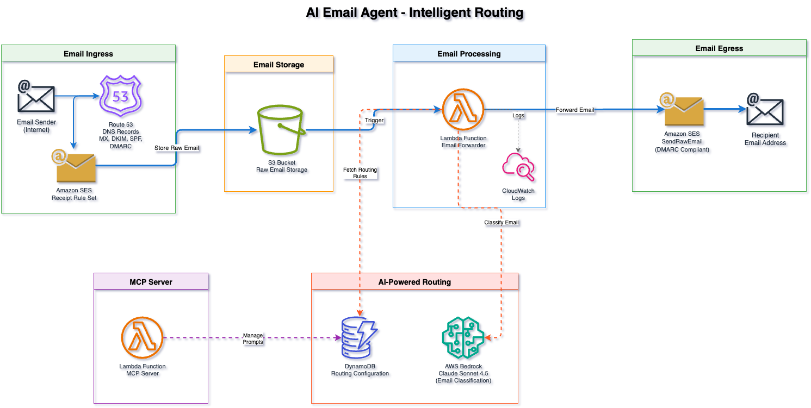

# Intelligent Email Forwarding with AWS Bedrock + SES

An intelligent email forwarding system that routes emails sent to `*@example.org` to your destination address (e.g., Gmail). Uses AWS Bedrock Claude to intelligently analyze and route emails based on content.

## Architecture Overview



This system works by pointing your domain's MX records to Amazon SES, which receives all incoming emails and stores them in an S3 bucket. A Lambda function is automatically triggered to process each email, sending the content to AWS Bedrock's Claude AI for intelligent routing decisions (like adding tags or routing to specific addresses based on content). Lambda then forwards the email to your destination address via SES, preserving the original message as an attachment. All DNS records are automatically configured in Route53, and DynamoDB stores your AI routing rules which you can update conversationally through Claude Code using the included MCP server - no need to redeploy infrastructure when you want to change how emails are routed.

## Features

- **Catch-all forwarding**: Forward any email sent to your domain
- **AI-powered routing** (optional): Automatically classify, tag, and route emails using Claude Sonnet 4.5
- **Conversational prompt management** (optional): Use Claude Code to update routing rules through natural conversation
- **Multi-domain support**: Manage multiple domains in the same AWS account
- **Automated DNS setup**: All DNS records configured automatically via Route53
- **DMARC/SPF compliant**: Preserves email authentication and deliverability
- **Production-ready**: Includes logging, monitoring, and error handling

## What Gets Deployed

When you run `terraform apply`, these AWS resources are created:

- **Route53**: Uses your existing hosted zone for DNS management
- **S3 bucket**: Stores raw inbound emails (30-day retention by default)
- **SES domain identity**: Verifies your domain and configures DKIM
- **Lambda function**: Python 3.13 function that processes and forwards emails
- **DynamoDB table**: Stores AI routing configuration (when AI routing enabled)
- **MCP server** (optional): Lambda function with public URL for conversational prompt management
- **IAM roles/policies**: Minimal permissions for Lambda execution
- **CloudWatch logs**: 30-day retention for debugging

All DNS records (MX, TXT, CNAME, DMARC) are automatically configured.

## Prerequisites

- AWS account with credentials configured (`aws configure`)
- Terraform >= 1.6, AWS provider >= 5.40
- **Domain using Route53 for DNS** (existing hosted zone required)
- SES receiving region (use `us-east-1` for widest availability)

## Quick Start

### 1. Configure Your Settings

Create `terraform.tfvars` with your domain and email settings:

```hcl
domain_name      = "example.org"
forward_to_email = "your@gmail.com"
region           = "us-east-1"
s3_bucket        = "my-email-bucket"
dmarc_rua_email  = "re+xxxxx@dmarc.postmarkapp.com"
```

Get your free DMARC reporting email from https://dmarc.postmarkapp.com/

### 2. Deploy Infrastructure

```bash
# Initialize Terraform (first time only)
terraform init

# Preview changes
terraform plan

# Deploy
terraform apply
```

Terraform will automatically:
- Configure all DNS records in Route53
- Verify your domain with SES (waits up to 5 minutes)
- Deploy Lambda function and S3 bucket
- Create DynamoDB table for AI routing

### 3. Test Email Forwarding

Send a test email to any address at your domain:

```bash
echo "Test message" | mail -s "Test" test@example.org
```

The email should arrive at your `forward_to_email` address within seconds.

## Setting Up Multiple Domains

You can forward emails for multiple domains in the same AWS account:

### First Domain

```bash
git clone <repo-url> domain1-email-forwarder
cd domain1-email-forwarder

# Create terraform.tfvars
cat > terraform.tfvars <<EOF
project_name     = "domain1-forwarder"
domain_name      = "domain1.com"
forward_to_email = "your@gmail.com"
region           = "us-east-1"
s3_bucket        = "domain1-emails"
dmarc_rua_email  = "re+xxxxx@dmarc.postmarkapp.com"
EOF

terraform init && terraform apply
```

### Second Domain

```bash
git clone <repo-url> domain2-email-forwarder
cd domain2-email-forwarder

# Create terraform.tfvars with DIFFERENT values
cat > terraform.tfvars <<EOF
project_name     = "domain2-forwarder"  # Must be different!
domain_name      = "domain2.org"
forward_to_email = "your@gmail.com"
region           = "us-east-1"          # Same region as first domain
s3_bucket        = "domain2-emails"     # Must be different!
dmarc_rua_email  = "re+xxxxx@dmarc.postmarkapp.com"
EOF

terraform init && terraform apply
```

**Important notes**:
- Use **different `project_name`** for each domain
- Use the **same `region`** for all domains
- Use **different S3 bucket names** for each domain
- Keep each domain's Terraform state in separate directories

## AI-Powered Routing (Optional)

Enable intelligent email routing using AWS Bedrock Claude:

### 1. Enable Bedrock Model Access

```bash
# Open Bedrock console
open https://console.aws.amazon.com/bedrock/home?region=us-east-1#/modelaccess

# Enable "Claude Sonnet 4.5" model access (click checkbox and save)
```

### 2. Enable AI Routing

Add to your `terraform.tfvars`:

```hcl
ai_routing_enabled = true
```

Then apply:

```bash
terraform apply
```

### 3. Configure Routing Rules

Add a routing prompt to DynamoDB:

```bash
# Get your table name
TABLE_NAME=$(terraform output -raw dynamodb_table_name 2>/dev/null || echo "ai-email-routing")

# Create a simple test prompt
cat > routing-prompt.json <<'EOF'
{
  "pk": {"S": "CONFIG"},
  "sk": {"S": "routing_prompt"},
  "prompt": {"S": "Analyze this email and add [TEST] tag.\n\nFrom: {sender}\nSubject: {subject}\nBody: {body}\n\nReturn JSON only:\n{\"route_to\": [\"your@gmail.com\"], \"tags\": [\"TEST\"], \"confidence\": 1.0, \"reasoning\": \"Test routing\"}"},
  "enabled": {"BOOL": true},
  "updated_at": {"S": "2025-01-15T12:00:00Z"}
}
EOF

# Upload to DynamoDB
aws dynamodb put-item --table-name "$TABLE_NAME" --item file://routing-prompt.json
```

### 4. Test AI Routing

Send a test email - Claude will analyze it and add the [TEST] tag to the subject.

For advanced routing rules, see [docs/bedrock.md](docs/bedrock.md).

## Conversational Prompt Management (Optional)

<video controls src="docs/mcp-claude.mov" title="MCP Server using Claude Code"></video>

The MCP (Model Context Protocol) server lets you manage email routing rules through natural conversation with Claude Code - no need to manually edit DynamoDB or redeploy infrastructure.

### What You Can Do

Ask Claude Code to help you:
- View your current routing rules
- Update routing logic with new rules
- Add tags for specific email types (urgent, sales, support)
- Review past prompt versions
- Test prompt syntax before applying changes

### Quick Setup

1. **Deploy the MCP server** (included automatically with `terraform apply`)

2. **Get your MCP server URL**:
   ```bash
   terraform output mcp_server_url
   ```

3. **Create an API key**:
   ```bash
   ./scripts/create-api-key.sh
   ```
   This creates a secure API key and stores it in DynamoDB. The key will be saved to `.env` file.

4. **Add MCP server to Claude Code**:

   ```bash
   # Get your server URL and API key
   MCP_URL=$(terraform output -raw mcp_server_url)
   API_KEY=$(grep MCP_API_KEY .env | cut -d'=' -f2)

   # Add the MCP server
   claude mcp add --transport http email-routing "$MCP_URL" \
     --header "Authorization: Bearer $API_KEY"
   ```

   To verify it was added:
   ```bash
   claude mcp list
   ```

   To remove it later (if needed):
   ```bash
   claude mcp remove email-routing
   ```

5. **Start using it**:

   Ask Claude Code:
   ```
   "Show me the current email routing prompt"
   "Update the routing rules to send sales emails to sales@example.com"
   "Add an [URGENT] tag for emails containing 'emergency' or 'critical'"
   ```

### Example Conversation

```
You: I want to route customer support emails to support@example.com

Claude: I'll help you update the routing prompt. Let me first check the current configuration.
        [Uses MCP to get current prompt]

        I can see you currently have basic routing. I'll add a rule to detect customer
        support inquiries. Here's what I'll add:

        - Customer support keywords: help, issue, problem, support, can't access
        - Route to: support@example.com
        - Tag: [SUPPORT]

        Should I update the prompt with these rules?

You: Yes, please

Claude: [Uses MCP to update prompt]
        Done! I've updated your routing rules. Customer support emails will now be
        routed to support@example.com with a [SUPPORT] tag.
```

### Benefits

- **No redeployment needed**: Update routing rules without running `terraform apply`
- **Iterative refinement**: Test and adjust rules based on real emails
- **Version history**: Automatically archives old prompts for rollback
- **Validation**: Check prompt syntax before applying changes
- **Conversational**: Describe what you want in plain English

For complete MCP server documentation, see [docs/mcp-server.md](docs/mcp-server.md).

For implementation details and architecture documentation, see [docs/architecture.md](docs/architecture.md).

## Monitoring and Logs

### View Lambda Logs

```bash
# Follow logs in real-time
aws logs tail "$(terraform output -raw lambda_log_group_name)" --follow

# Search for errors
aws logs filter-log-events \
  --log-group-name "$(terraform output -raw lambda_log_group_name)" \
  --filter-pattern "ERROR"
```

### View AI Routing Decisions

```bash
# See AI routing decisions
aws logs filter-log-events \
  --log-group-name "$(terraform output -raw lambda_log_group_name)" \
  --filter-pattern "AI routing decision"
```

### Check DynamoDB Routing Prompt

```bash
aws dynamodb get-item \
  --table-name "$(terraform output -raw dynamodb_table_name)" \
  --key '{"pk":{"S":"CONFIG"},"sk":{"S":"routing_prompt"}}' \
  --query 'Item.prompt.S' \
  --output text
```

## Troubleshooting

For troubleshooting common issues including email delivery problems, AI routing failures, MCP server issues, and multi-domain conflicts, see [docs/troubleshooting.md](docs/troubleshooting.md).

## Advanced Configuration

### Disable Email Deletion

By default, emails are deleted from S3 after 30 days. To keep emails indefinitely, you can modify the S3 lifecycle configuration in `main.tf` and run `terraform apply`.

For details, see [docs/architecture.md](docs/architecture.md).

### Enable Verbose Logging

For detailed debugging information:

```bash
aws lambda update-function-configuration \
  --function-name "$(terraform output -raw lambda_function_name)" \
  --environment "Variables={VERBOSE_LOGGING=true,...}"
```

### Change Bedrock Model

To use a faster/cheaper model like Claude Haiku:

```hcl
# terraform.tfvars
bedrock_model_id = "us.anthropic.claude-3-5-haiku-20241022-v1:0"
```

See [docs/bedrock.md](docs/bedrock.md) for model comparison.

## Security

This project follows AWS security best practices:

- S3 bucket blocks all public access
- IAM roles use least privilege permissions
- CloudWatch logs encrypted at rest (30-day retention)
- DynamoDB encryption at rest enabled
- SES enforces TLS for email transmission
- Lambda uses VPC endpoints (optional, not configured by default)

## Uninstalling

To remove all resources:

```bash
# Destroy infrastructure (removes MCP server, Lambda, S3, DynamoDB, etc.)
terraform destroy

# Clean up local files
rm -rf .terraform terraform.tfstate* lambda.zip mcp_lambda.zip .env
```

Note: S3 bucket must be empty before destruction. Set `force_destroy = true` in main.tf to automatically empty bucket.

## License

This project is provided as-is for educational and production use.

## Author

Simon Cornelius P. Umacob <f8cuek187@mozmail.com>
